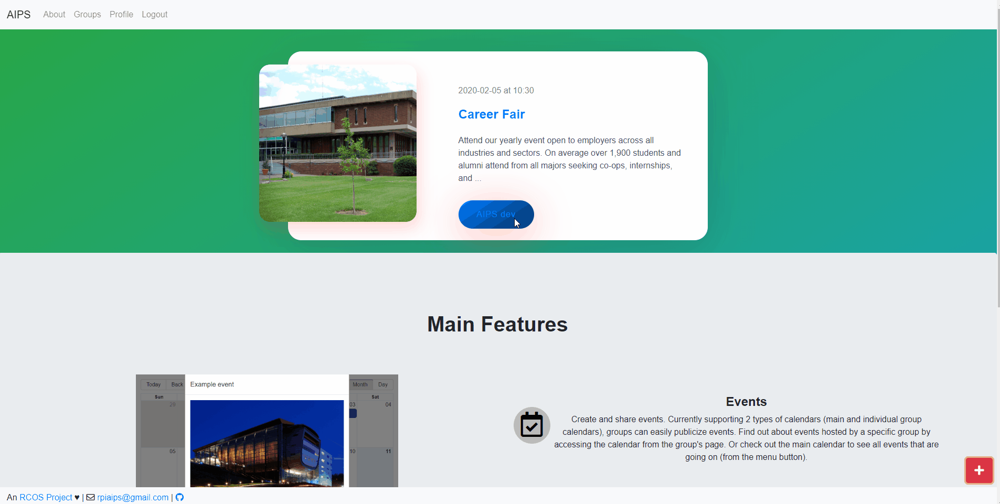

# An Intuitive Platform for Societies (AIPS)

AIPS is a Web App to create a general, intuitive and interactive way of communication between students and societies.

# Start up

1. [Node.js](https://nodejs.org/en/)(10.x <= 12.x), npm(6.x >=), [Yarn](https://yarnpkg.com/lang/en/), [Docker](https://www.docker.com/) are required.
1. Run Docker on local environment
1. Add a env var file to the /config (**ask admin**)
1. Start docker containers ```docker-compose -f docker-compose.dev.yml up```
1. Install Yarn
1. Install and lock dependencies ```yarn```
1. Sequelize migrations ```yarn db:migrate```
1. Sequelize seeds ```yarn db:seed```
1. Run server ```yarn dev```

# Preview



# Deployment

[nohup and nodemon](https://github.com/remy/nodemon/issues/296#issuecomment-47304621)

## [IF NODE SERVER IS RUNNING] Identify and stop the server (processes) running in the background

Move to the root of the AIPS directory
```
cd aips
```

Find the processes running the node server
```
ps aux | grep node
```

Other than the command **grep --color=auto node**, there should be processes running 3 different index.js files. If there are no other node processes running apart from the 3, killall,
```
sudo killall -9 node
```

or, kill each process accordingly with the PIDs.
```
sudo kill -9 [PID HERE]
```

Confirm the server's processes were killed.
```
ps aux | grep node
```

## Update the remote repository files

Pull the updated branch
```
git pull --rebase origin master
```

## [IN CASE OF DATABASE SCHEMA CHANGES NEEDED TO BE MADE ( changes in /src/db/* )] Access the MariaDB server, backup the existing data, drop the database tables that need to be changed, and re-migrate the models/seeders ( & load backup if needed )

Check the mariadb server's status
```
sudo systemctl status mariadb
```

If the mariadb server **isn't** active, start the server
```
sudo systemctl start mariadb
```

If the mariadb server is **active**, make a backup of the database, referring to the environmental variables (/config/env.*)
**Make sure that there isn't an error callback (which will result in an empty backup)**
```
mysqldump --user=[DB_USER] --password --lock-tables --databases [DB_NAME] > ~/aips/backup/[DATE OF BACKUP].sql
```

Access the database
```
sudo mariadb [DB_NAME]
```

Drop the table(s) in the database that will be affected (associations too?)
```sql
DROP TABLE [TABLE NAME];
...
..
.
```

Exit the database
```sql
exit
```

Remigrate the models and seeders
```
yarn
yarn db:migrate:prod
yarn db:seed:prod
```

## Restart the node server

```
yarn
yarn build
yarn start
```